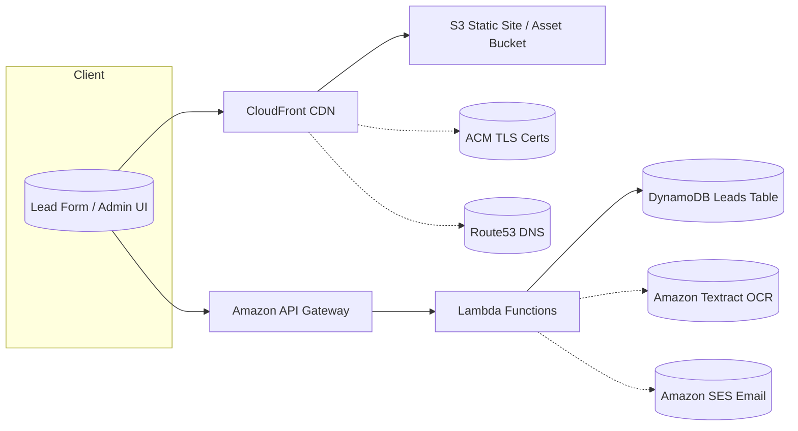

# AWS Realtor CRM (GitHub Showcase)

This repository contains an AWS-native Realtor CRM built with CloudFormation/SAM and serverless components.
It is structured to **showcase the integral AWS services** used in the solution, with clear docs, diagrams, and CI.

> Replace placeholders with your real template/code. Drop your existing `template.yaml` and Lambda code into this repo.

## Highlights
- **Architecture diagram** (Mermaid) in [`docs/architecture.md`](docs/architecture.md)
- **Services catalog** auto-generated from CloudFormation in [`docs/services.md`](docs/services.md)
- **CI workflow** with CloudFormation lint in [`.github/workflows/ci.yml`](.github/workflows/ci.yml)
- **Helper scripts** in [`scripts/`](scripts/)
- **Makefile** targets for common tasks

## Architecture (quick view)


## Getting Started

### Prerequisites
- AWS account + IAM access
- AWS CLI installed and configured
- (Optional) AWS SAM CLI for local builds
- Python 3.10+ for helper scripts

### Repo Layout
```
.
├─ template.yaml                 # Put your real CloudFormation/SAM template here
├─ src/                          # Your Lambda/API code
├─ scripts/                      # Utilities (e.g., generate services doc)
├─ docs/
│  ├─ architecture.md            # Mermaid diagram and explanation
│  └─ services.md                # Generated: AWS services and resources summary
├─ .github/workflows/ci.yml      # Lint CFN on PRs
├─ Makefile
├─ SECURITY.md
├─ CONTRIBUTING.md
├─ LICENSE
└─ .gitignore
```

### Show the integral services
1. Place your actual `template.yaml` at the repo root (replace the placeholder).
2. Run:
   ```bash
   make gen-services
   ```
   This will parse the template and update **docs/services.md** with a readable table of AWS services and resource counts.

### Local development
- Put your Lambda functions under `src/` (subfolders per function).
- If you use SAM, you can run `sam build` and `sam local start-api` as usual.

### CI
- A basic CI workflow lints your CloudFormation on PRs.
- For deploy-from-GitHub, create an AWS IAM role that trusts GitHub OIDC and uncomment the `deploy` job in the workflow.

### Publishing to GitHub
```bash
git init
git add .
git commit -m "Initial: AWS Realtor CRM GitHub-ready repo"
git branch -M main
git remote add origin https://github.com/<your-username>/<your-repo>.git
git push -u origin main
```
