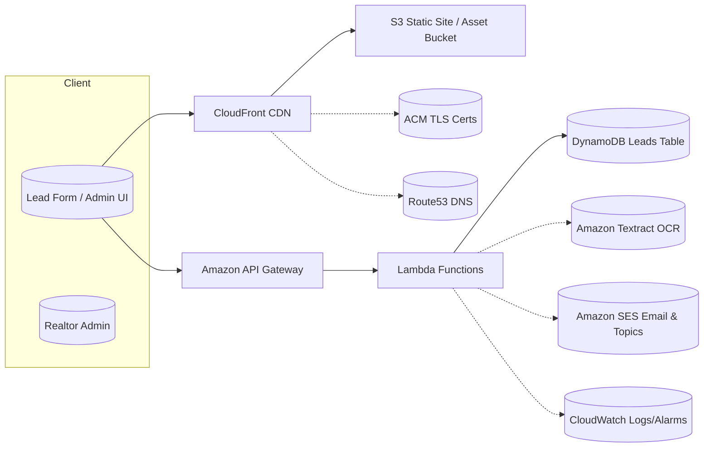

# Architecture

The Realtor CRM uses a serverless-first design that emphasizes managed AWS services.

**Key flows**
- **Visitor -> Lead**: Browser submits to API Gateway → Lambda validates & stores in DynamoDB → SES sends confirmation/drip.
- **Open House OCR**: S3 upload event triggers Lambda → Textract extracts names/emails → DynamoDB → SES segment.
- **Branding**: CloudFront + ACM serve static assets over TLS; Route53 manages DNS.
